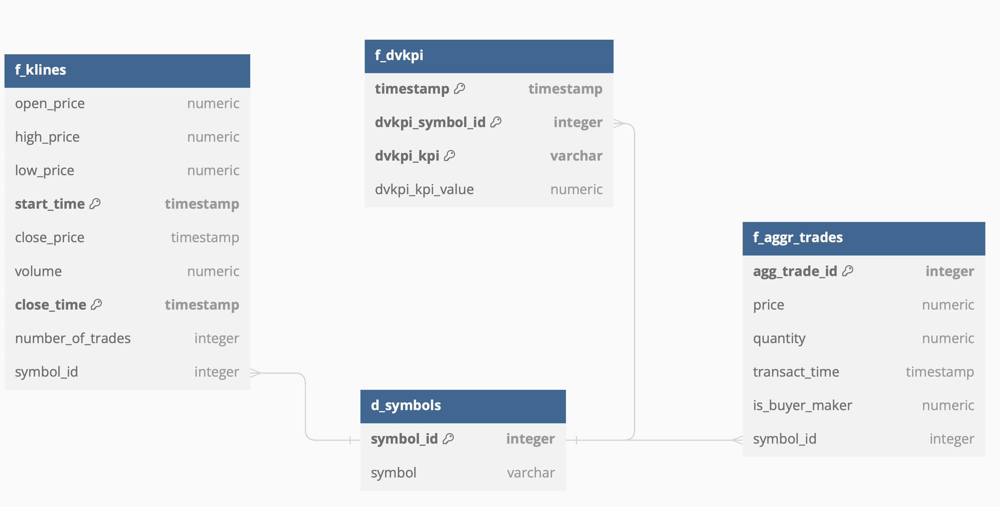

# CDE-SEP23-OPA-INT

This project aim to create a trade bot leveraging binance API for buying crypto

## Binance API
https://binance-docs.github.io/apidocs/spot/en/#check-server-time

binance historical data
https://www.binance.com/en/support/faq/how-to-download-historical-market-data-on-binance-5810ae42176b4770b880ce1f14932262

## Local Development

1. Verify you contain Doker desktop: [Docker Download](https://www.docker.com/products/docker-desktop/)
2. run ```docker-compose up --build```
    This will create the postgres dependencies
3. run ``` python load_data.py```
    This will create the db tables and load initial data
4. Verifying data on a client <br>
4.1  Local Pg Admin Client
   * host: localhost 
    * user:db_user 
    * pass: pgpassword123 
    * db: opa_db<br>
4.2  alternatively you can run on the pgadmin client on the docker image using:
    * host: postgres
    * user: db_user
    * pass: pgpassword123
    <br>
    **Obs:** the pq client runs on localhost:5050
       * PGADMIN_DEFAULT_EMAIL: admin@example.com 
       * PGADMIN_DEFAULT_PASSWORD: admin123  
5. Extra -> recommendation of pgclient: [PgAdmin Download](https://www.pgadmin.org/download/)
6. In case you need to remove the db to reupload data the following command will remove the container and the volume so all data on db will be lost
    ```docker-compose down -v```


## Deliverables

2. For the second deliverable after creating the db one can check the 10 first from each table on the db tables on:
```python db_tester.py```

### DB schema:




## Extras

