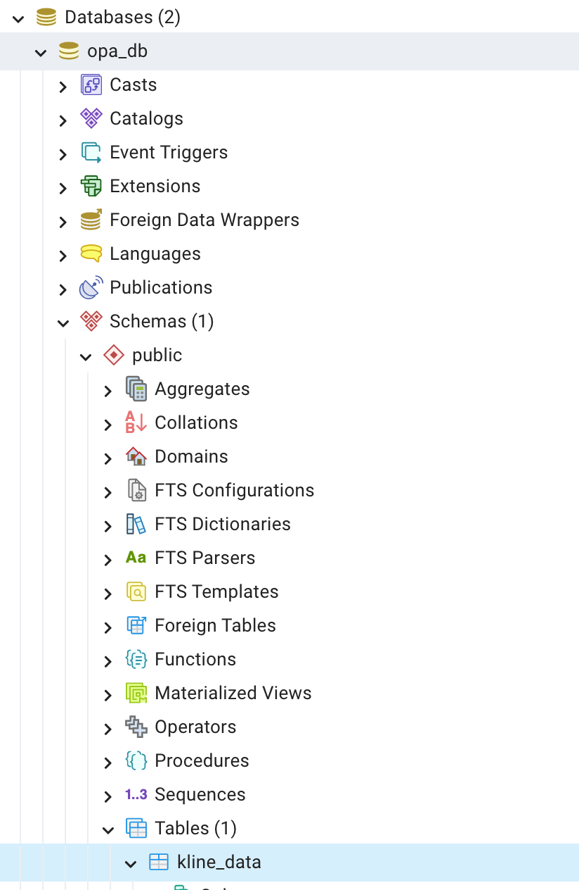

# CDE-SEP23-OPA-INT

This project aim to create a trade bot leveraging binance API for buying crypto

## Binance API
https://binance-docs.github.io/apidocs/spot/en/#check-server-time

binance historical data
https://www.binance.com/en/support/faq/how-to-download-historical-market-data-on-binance-5810ae42176b4770b880ce1f14932262

## Local Development

1. Verify you contain Doker desktop: [Docker Download](https://www.docker.com/products/docker-desktop/)
2. run ```docker-compose up --build```
    This will create the postgres dependencies
3. run ``` python load_data.py```
    This will create the db tables and load initial data
3. After running the scripts you can verify the data on a local postgres on: 
    * localhost:5432 
    * user:db_user 
    * pass: pgpassword123 
    * db: opa_db
4. Extra -> recommendation of pgclient: [PgAdmin Download](https://www.pgadmin.org/download/)
5. In case you need to remove the db to reupload data the following command will remove the container and the volume so all data on db will be lost
    ```docker-compose down -v```


