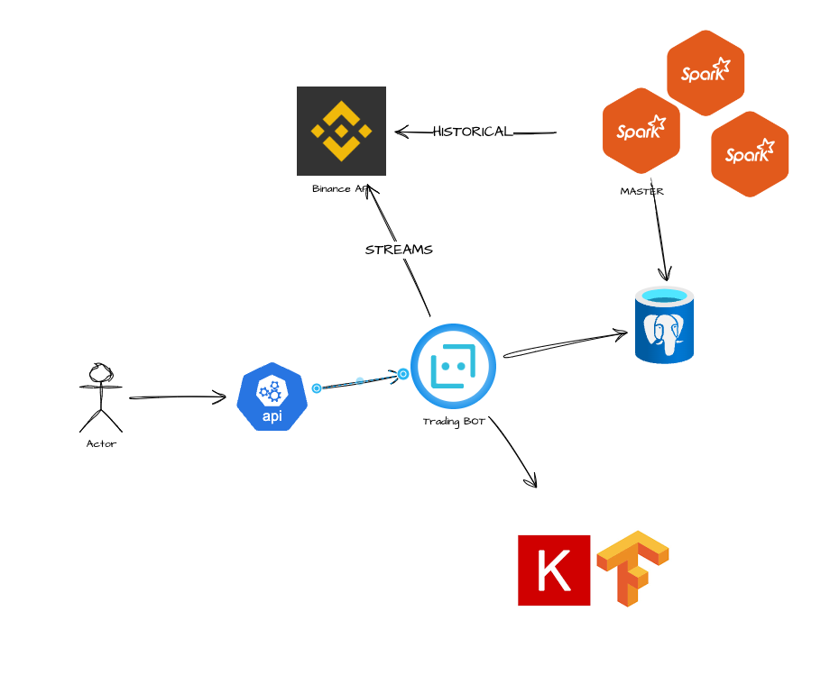
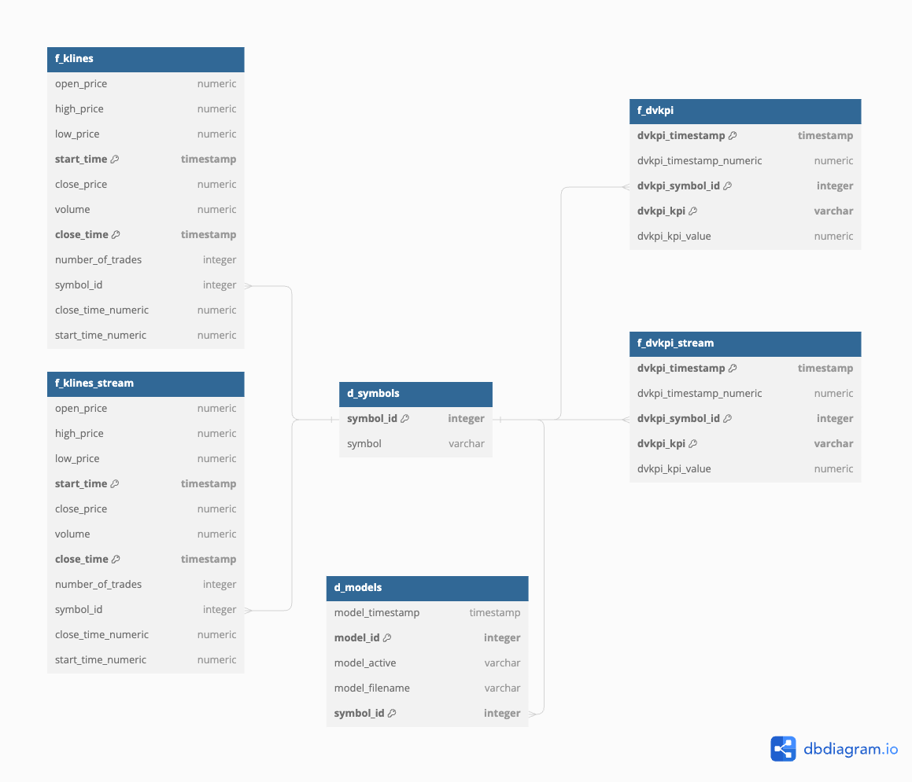

# CDE-SEP23-OPA-INT

This project creates a bot that uses a trained model based on clandesticks data for ETHEUR and take decisions regarding buy or not

## Modules

### 1. Infra
[Infra](src/infra/)

Infra is a conteinarized api that initializes the db by creating the tables of the project as well as adding important initial data.

Initial data added:
- ETHEUR to table d_symbols
- An already trained model to d_models table. 

The tables it adds are represented on the following:

### 2. ETL
[ETL](src/load_data_etl/)

The load_data_etl is a conteinarized application that runs a spark master and 2 workers
This application downloads kline daily historical data till the present date. 

A single zip file will be downloaded per day. 
Finally the module will unzip all of them and get a csv with the data.
All of these csvs will be merged together and a transformation will take place.

Finally the tables f_klines and f_dvkpi will be filled with historical data

#### Customization

By modifying the environment variable DOWNLOAD_YEAR one can specify the beginning date.
This variable can be updated on the spark-master container on docker-compose
If DOWNLOAD_YEAR is not set the default 2024 will be chosen.
If DOWNLOAD_YEAR is set to 2022. It will download one file per day from 01-01-2022 until yesterday date.

### 3. Trading bot API

The api of the trading bot will be available on port 8086

The Bot is callable via API and monitors the market until a user defined timeout is reached. Throughout this monitoring 
period the bot makes investment decisions by constantly predicting future prices and comparing it to the most recent one.
Thus, the user can for instance specify that he wants to have the bot running for two hours and within this time, the bot will trade.

Predictions are based on a pre-trained LSTM Model (Deep Neural Network). Note that since the Model can - given historical data - only 
predict the next kline price, a prediction for multiple Minutes ahead (i.e. the price in 10min) depends on predicted prices 
itself (e.g. predicted price in 9, 8, 7 ... 1 Minute).

Note that trading is not done with actual wallet funds but hypothetical ones.

Further info on how to handle requests can be found in the FastAPI documentation: 127.0.0.1:8086/docs

### DB Access
    * user:db_user 
    * pass: pgpassword123 
    * db: opa_db
    

## Useful Links
https://binance-docs.github.io/apidocs/spot/en/#check-server-time

binance historical data
https://www.binance.com/en/support/faq/how-to-download-historical-market-data-on-binance-5810ae42176b4770b880ce1f14932262